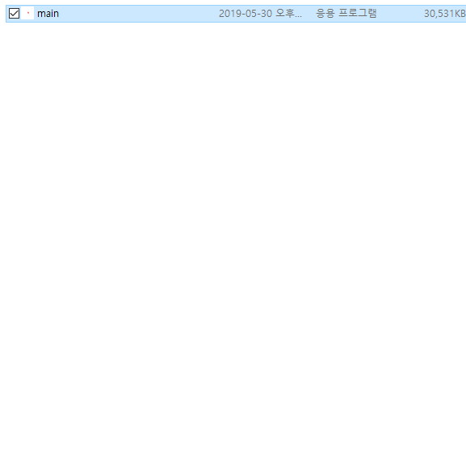
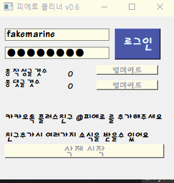
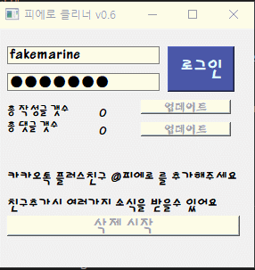

# 디시인사이드 클리너

--------------------------------------------
#### 해당 클리너는 타 클리너와 달리 서버에서 모든작업을 처리해주는것이아니라 사용자PC에서 모든작업이 처리됩니다.
#### 따라서 개인컴퓨터환경이나 인터넷속도에따라 클리너 작동속도가 달라질수있습니다.
--------------------------------------------
### 실행 방법

####  **직접실행**
######  직접실행시 pyqt5, requests, beautifulsoup4, lxml 모듈이 설치되있어야 정상작동됩니다.
> C:\Users\dobidugi\src> python3 main.py

or 
> C:\Users\dobidubi\src> python main.py

#### **exe파일로 실행**

파일 다운받기 : <https://github.com/dobidugi/dcinside-cleaner/releases/tag/v0.8>

압축을 해재후 main 폴더 안에 main.exe를 이용해 실행

프로그램 실행전 꼭 디시인사이드 공앱을 종료시켜주세요.

--------------------------------------------

## 동작화면

-------------------------------------------

###  **ToDo** 
 -  **2019. 2. 22 정상작동**
 -  **2019. 2. 23 리스트뽑아오는 방식 변경, 진행상황 출력변경(v0.2)**
 -  **2019. 2. 23 삭제중 멈춤현상 일부 개선완료(v0.3)**
 -  **2019. 3. 12 정보 무한수집 현상 개선완료(v0.4)**
 -  **2019. 2. 23 window7버전에서 작동하지않는현상 개선완료 main_2폴더이용(v0.4)**
 -  **2019. 3. 12 안내멘트 약간수정(v0.4)**
 -  **2019. 3. 12 정상작동(v0.4)**
 -  **2019. 3. 12 분할삭제모드 추가(v0.5)**
 -  **2019. 5. 19 디시 갤로그개편으로 마이너갤러리 삭제 지원**
 -  **2019. 5. 30 v0.6 업데이트 !!**
    **- CLI환경에서 GUI 환경으로 업그레이드**
    **- 0.5버전에비해 삭제속도 20배증가**
 -  **2019. 5. 30 gallcode_db 생성, 일부버그 수정 (v0.7)**
 -  **2019. 6. 02 디시인사이드 6.1 패치 대응 (v0.8)**
-------------------------------------------
### 기타 문의사항이나 건의사항은 카카오톡 플러스친구 @피에로 로 연락주세요
### http://pf.kakao.com/_CxjluT
